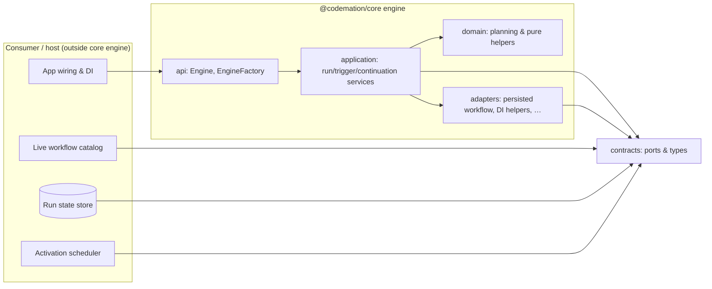

# Codemation engine architecture

This document describes the **workflow execution engine** inside `@codemation/core`: what it owns, how it is structured, and how the pieces cooperate. It is written for **new readers** first and **implementation-focused readers** second.

---

## How to read this doc

| If you…                                    | Start here, then…                                                                                                                                  |
| ------------------------------------------ | -------------------------------------------------------------------------------------------------------------------------------------------------- |
| Want a **5-minute mental model**           | [What the engine is](#what-the-engine-is-for-a-general-audience) → [Big picture](#big-picture) → [Glossary](#glossary)                             |
| Need to **navigate the codebase**          | [Source layout](#source-layout-packagescoresrcengine) → [Public entry points](#public-entry-points)                                                |
| Are **implementing or extending** behavior | [Layered design](#layered-design) → [Ports and dependencies](#ports-and-dependencies) → [Execution pipeline](#execution-pipeline-for-implementers) |

---

## What the engine is (for a general audience)

The engine is the **runtime that runs workflows**: it schedules work between nodes, persists progress, resumes after failures or external waits, and coordinates triggers (for example webhooks). It is **not** the product UI, HTTP server shell, or database schema—those live in host and app packages and plug into the engine through **well-defined interfaces** (“ports”).

**In one sentence:** the engine turns _workflow definitions + items of data_ into _durable runs_ with deterministic orchestration rules.

---

## What the engine deliberately does _not_ do

Keeping these boundaries stable is what lets the monorepo stay modular:

- **No opinionated HTTP/UI** — consumers use `@codemation/host` / Next host for gateways and screens.
- **No node plugin catalog inside core** — nodes live in separate packages (`@codemation/core-nodes`, `node-*`, etc.); core stays a **contract + runtime** layer.
- **No direct infrastructure** in domain logic — file/DB/queue access is behind injected ports (`RunStateStore`, `NodeActivationScheduler`, …).

---

## Big picture

At runtime, **host wiring** constructs an `Engine` (usually via `EngineFactory`) and registers implementations for **ports** such as `WorkflowRepository`, `RunStateStore`, and `NodeActivationScheduler`.

---

## Glossary

| Term                            | Meaning                                                                                                 |
| ------------------------------- | ------------------------------------------------------------------------------------------------------- |
| **Workflow definition**         | In-memory graph: nodes, edges, and typed node configs discovered from code/config.                      |
| **Run**                         | One execution of a workflow from some entry node, with a stable **run id** and persisted state.         |
| **Activation**                  | A unit of scheduled node work (often tied to a **node activation id** and optional queue receipt).      |
| **Items**                       | The data flowing between nodes (batches per node invocation).                                           |
| **Live workflows**              | The current definitions available at runtime (`list` / `get` via `WorkflowRepository`).                 |
| **Persisted workflow snapshot** | Serialized workflow shape stored on a long-lived run so older runs can be resumed even if code changes. |
| **Trigger**                     | Entry path that can start or feed a workflow (webhooks, manual, etc.—depending on packages wired in).   |

---

## Source layout (`packages/core/src/engine`)

The engine code is grouped by responsibility:

| Folder         | Role                                                                                                                                                         |
| -------------- | ------------------------------------------------------------------------------------------------------------------------------------------------------------ |
| `api/`         | **Facade & composition root**: `Engine` (thin surface), `EngineFactory` (wires internal services).                                                           |
| `application/` | **Orchestration**: start/resume runs, triggers, intents, state publishing, waiters, credentials glue, execution services.                                    |
| `domain/`      | **Pure logic**: planning, frontier/current-state helpers, snapshot-oriented utilities without I/O.                                                           |
| `adapters/`    | **Concrete helpers** that implement engine-facing concerns: persisted-workflow materialization, container `NodeResolver`, in-memory matchers for tests, etc. |
| `scheduling/`  | **Schedulers & offload policy** implementations used when executing activations.                                                                             |
| `storage/`     | **Run-store helpers** bundled with the engine package (in-memory implementations for tests/dev tooling).                                                     |
| `graph/`       | **Graph construction** helpers for executable workflow structure.                                                                                            |
| `context/`     | **Execution context** defaults (including binary attachment factories used along runs).                                                                      |
| `planning/`    | Legacy/extra planning entry points; **prefer `domain/planning/`** for the canonical graph algorithms where duplicated.                                       |

> **Note:** Over time, some planning code exists in both `planning/` and `domain/planning/` as refactors land. When in doubt, follow imports from `application/` services.

Stable **cross-cutting contracts** (ports shared beyond the engine folder) live under `packages/core/src/contracts/` and are re-exported via `packages/core/src/types/`.

---

## Public entry points

- **`Engine`** (`engine/api/Engine.ts`): the **facade** consumers call—`start`, `runWorkflow`, resume methods, webhook trigger matching, etc. It delegates to injected services and does not embed orchestration logic.
- **`EngineFactory`** (`engine/api/EngineFactory.ts`): the **composition root** for engine-internal services. It constructs collaborators (persisted-workflow resolver, run starters, continuation service, trigger runtime, …) from `EngineDeps` / `EngineCompositionDeps`.
- **Barrel** (`engine/index.ts`): re-exports the engine’s supported public surface for `@codemation/core` (alongside other package exports in `src/index.ts`).

For **tests only**, in-memory workflow helpers are exposed from `@codemation/core/testing` so production bundles do not treat them as the default runtime story.

---

## Layered design

### 1. API layer (`engine/api/`)

- **`Engine`** exposes a **stable, narrow interface** and implements **`NodeActivationContinuation`** so the activation scheduler can call back into resume semantics.
- **`EngineFactory.create`** is the **single preferred place** to instantiate the graph of engine services, keeping `new` out of domain code (see repo ESLint rules around manual DI).

### 2. Application layer (`engine/application/`)

Typical responsibilities:

- **Execution** — `WorkflowRunStarter`, `CurrentStateRunStarter`, `RunContinuationService`, `RunStateSemantics`, `ActivationEnqueueService`.
- **Triggers** — `TriggerRuntimeService` (bootstraps triggers against `WorkflowRepository`).
- **Intents / runners** — `RunIntentService`, `EngineWorkflowRunnerService` (higher-level “run by id” style entry points).
- **State & events** — publishers/factories for node lifecycle marks and run events.
- **Waiters** — coordination for completion / webhook waits (`EngineWaiters`).

These classes **orchestrate**; they depend on ports and pure domain helpers.

### 3. Domain layer (`engine/domain/`)

**Deterministic** helpers: planning (`WorkflowTopology`, queue planning, frontier/current-state planners), execution snapshot helpers (`NodeSnapshotFactory`, diagnostics types), etc.

Domain code should avoid **constructing** infrastructure; it works on data structures and contracts.

### 4. Adapters layer (`engine/adapters/`)

Bridge **ports** to **implementations**:

- **Persisted workflow** — snapshot serialization/hydration/resolution (`PersistedWorkflowResolver`, `PersistedWorkflowSnapshotFactory`, config hydrator, missing-node placeholders).
- **DI** — `ContainerNodeResolver`, `ContainerWorkflowRunnerResolver`.
- **Nodes** — `NodeInstanceFactory` mapping definitions to executable node instances via `NodeResolver`.

Host-specific catalogs (e.g. Postgres-backed definitions) stay **outside** core; core only sees **`WorkflowRepository` / `WorkflowCatalog`**.

---

## Ports and dependencies

The engine’s external surface area is expressed as **TypeScript interfaces** in `packages/core/src/contracts/runtimeTypes.ts` (aggregated through `packages/core/src/types/`).

### Workflow access: repository vs catalog

- **`WorkflowRepository`** — read-only: `list()` and `get(workflowId)`. Used anywhere the engine only needs to **read** discovered workflows (triggers, run-by-id, etc.).
- **`WorkflowCatalog`** — extends the repository with **`setWorkflows(...)`** for the **mutable** “what is currently loaded” view. `Engine.loadWorkflows` updates both token registration and the catalog.

In DI, prefer the **`WorkflowCatalog`** token for the canonical mutable registration; a **`WorkflowRegistry`** name may exist as a **compatibility alias** pointing at the same instance.

### Other ports (representative)

- **`RunStateStore`** — load/save run state, listings, summaries (persistence).
- **`NodeActivationScheduler`** — enqueue activations (local or worker queues).
- **`PersistedWorkflowTokenRegistryLike`** — token metadata for serializable configs.
- **`NodeResolver`** — resolve `TypeToken`s to node implementations (from DI).
- **`WebhookTriggerMatcher` / `WebhookRegistrar`** — route inbound HTTP to trigger nodes when wired.

`EngineDeps` (see `runtimeTypes.ts`) is the **bundle of ports** `EngineFactory` expects.

---

## Composition: `EngineFactory` and `EngineCompositionDeps`

`EngineFactory.create` builds the internal graph:

- **Persisted workflow pipeline** — constructs `PersistedWorkflowSnapshotFactory` and `PersistedWorkflowResolver` (hydration + missing-runtime placeholders) **inside the factory** so hosts do not reassemble this pipeline by hand.
- **Run services** — wires run starter, current-state starter, continuation service, trigger runtime, waiters, publishers.

`EngineCompositionDeps` extends `EngineDeps` with **optional overrides** for advanced tests or bespoke wiring (for example injecting a custom hydrator). Defaults keep construction centralized in `EngineFactory`.

---

## Live workflows vs persisted snapshots

| Concern             | Live                                                          | Persisted                                                                                  |
| ------------------- | ------------------------------------------------------------- | ------------------------------------------------------------------------------------------ |
| **Source of truth** | Current definitions in the **`WorkflowCatalog` / repository** | **`workflowSnapshot`** stored on the run record                                            |
| **Used for**        | Scheduling new work, triggers, “run latest”                   | Resuming old runs, drift-tolerant execution                                                |
| **Materialization** | Engine reads from repository                                  | `PersistedWorkflowResolver` combines snapshot + registry tokens into a runnable definition |

**Outsider takeaway:** “Live” is what your deployment knows about _now_; “persisted” is what a specific _historical run_ recorded _then_.

**Nerd detail:** resolvers and hydrators live under `engine/adapters/persisted-workflow/`; they are intentionally **not** something host apps should fork lightly—keep them engine-internal.

---

## Execution pipeline (for implementers)

High-level flow for a typical forward run:

1. **Plan** — build a `WorkflowTopology` and planner (via `EngineWorkflowPlanningFactory` and domain planners).
2. **Enqueue** — `ActivationEnqueueService` schedules activations through `NodeActivationScheduler`.
3. **Execute** — schedulers run node `execute` methods with **batched items** (core contract: nodes receive **items as a batch**).
4. **Persist** — `RunStateStore` records outputs, snapshots, and continuation points.
5. **Continue** — `RunContinuationService` resumes when nodes complete, fail, or wait (webhooks, external workers).

For **resume-from-state** and **partial replays**, `CurrentStateRunStarter` and frontier planners consult **current run state** rather than assuming a cold start.

---

## Triggers and webhooks

`TriggerRuntimeService` uses **`WorkflowRepository.list()`** to discover trigger nodes across workflows, cooperates with **`WebhookRegistrar`** / **`WebhookTriggerMatcher`**, and delegates “start execution” to the same run starter path as manual runs.

Exact HTTP behavior belongs to host packages; the engine exposes **matching** and **continuation** primitives.

---

## Scheduling and offload

Under `engine/scheduling/` you will find:

- **Driving schedulers** (inline vs default driving).
- **Offload policies** — hints for whether work should run locally vs be queued (integration with BullMQ lives in `packages/queue-bullmq`).

---

## Testing strategy (mental model)

- **Unit tests** in `packages/core/test/` exercise the engine with **real small nodes** and in-memory stores—minimal mocking (per repo testing standards).
- **`@codemation/core/testing`** exposes **in-memory workflow catalog** helpers for tests **only**—not as the supported production story.

---

## Related reading

- **Repository-wide contributor rules** — `AGENTS.md`
- **Contracts** — `packages/core/src/contracts/runtimeTypes.ts`
- **Host wiring** — `packages/host/src/codemationApplication.ts` (DI registration for catalog, engine, stores)

---

## Changelog discipline

When you change execution semantics, prefer:

1. Update **contracts** if boundaries change.
2. Keep **`Engine` thin**—shift logic into named services under `application/` or pure code under `domain/`.
3. Document **user-visible behavior** in PR descriptions; update this file when folder boundaries or port meanings shift.
