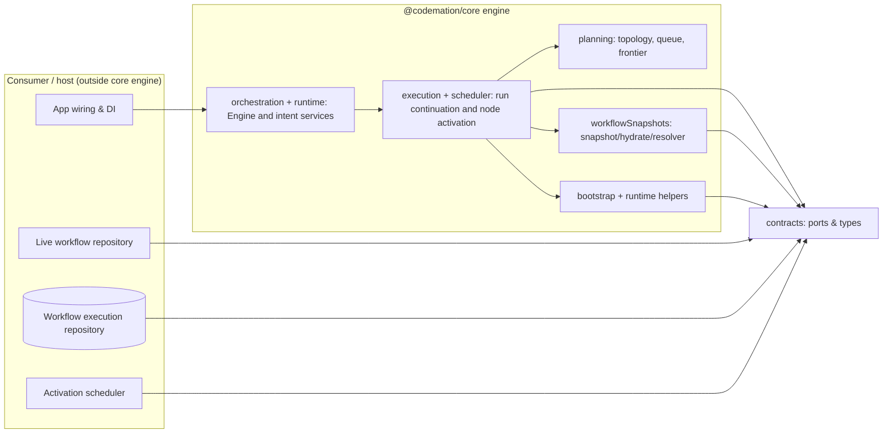

# Codemation engine architecture

This document describes the **workflow execution engine** inside `@codemation/core`: what it owns, how it is structured, and how the pieces cooperate. It is written for **new readers** first and **implementation-focused readers** second.

---

## How to read this doc

| If you…                                    | Start here, then…                                                                                                                                  |
| ------------------------------------------ | -------------------------------------------------------------------------------------------------------------------------------------------------- |
| Want a **5-minute mental model**           | [What the engine is](#what-the-engine-is-for-a-general-audience) → [Big picture](#big-picture) → [Glossary](#glossary)                             |
| Need to **navigate the codebase**          | [Source layout](#source-layout-packagescoresrcengine) → [Public entry points](#public-entry-points)                                                |
| Are **implementing or extending** behavior | [Layered design](#layered-design) → [Ports and dependencies](#ports-and-dependencies) → [Execution pipeline](#execution-pipeline-for-implementers) |

---

## What the engine is (for a general audience)

The engine is the **runtime that runs workflows**: it schedules work between nodes, persists progress, resumes after failures or external waits, and coordinates triggers (for example webhooks). It is **not** the product UI, HTTP server shell, or database schema—those live in host and app packages and plug into the engine through **well-defined interfaces** (“ports”).

**In one sentence:** the engine turns _workflow definitions + items of data_ into _durable runs_ with deterministic orchestration rules.

---

## What the engine deliberately does _not_ do

Keeping these boundaries stable is what lets the monorepo stay modular:

- **No opinionated HTTP/UI** — consumers use `@codemation/host` / Next host for gateways and screens.
- **No node plugin catalog inside core** — nodes live in separate packages (`@codemation/core-nodes`, `node-*`, etc.); core stays a **contract + runtime** layer.
- **No direct infrastructure** in domain logic — file/DB/queue access is behind injected ports (`WorkflowExecutionRepository`, `NodeActivationScheduler`, …).

---

## Big picture

At runtime, **host wiring** registers implementations for **ports** such as `LiveWorkflowRepository`, `WorkflowRepository`, `WorkflowExecutionRepository`, and `NodeActivationScheduler`, then calls `EngineRuntimeRegistrar` so the container can resolve `Engine` and the intent services directly.

---

## Glossary

| Term                            | Meaning                                                                                                 |
| ------------------------------- | ------------------------------------------------------------------------------------------------------- |
| **Workflow definition**         | In-memory graph: nodes, edges, and typed node configs discovered from code/config.                      |
| **Run**                         | One execution of a workflow from some entry node, with a stable **run id** and persisted state.         |
| **Activation**                  | A unit of scheduled node work (often tied to a **node activation id** and optional queue receipt).      |
| **Items**                       | The data flowing between nodes (batches per node invocation).                                           |
| **Live workflows**              | The current definitions available at runtime (`list` / `get` via `WorkflowRepository`).                 |
| **Persisted workflow snapshot** | Serialized workflow shape stored on a long-lived run so older runs can be resumed even if code changes. |
| **Trigger**                     | Entry path that can start or feed a workflow (webhooks, manual, etc.—depending on packages wired in).   |

---

## Source layout (`packages/core/src`)

The engine code is now grouped by top-level systems instead of a single `engine/` catch-all:

| Folder               | Role                                                                                                                               |
| -------------------- | ---------------------------------------------------------------------------------------------------------------------------------- |
| `workflow/`          | Workflow authoring and structure: `dsl/`, `definition/`, and `graph/`.                                                             |
| `orchestration/`     | The engine facade and long-running coordination flow: `Engine`, trigger runtime, waiters, run start, and run continuation.         |
| `runtime/`           | Host-facing services and in-memory runtime helpers such as `EngineFactory`, `RunIntentService`, and `EngineWorkflowRunnerService`. |
| `execution/`         | Node execution, activation enqueue, retry helpers, execution context, and state-writing helpers.                                   |
| `planning/`          | Topology, queue, cycle, frontier, and current-state planning.                                                                      |
| `workflowSnapshots/` | Persisted workflow hydration, serialization, token registry, and missing-runtime stand-ins.                                        |
| `policies/`          | Execution limits, run policy snapshots, storage/error policy helpers.                                                              |
| `runStorage/`        | In-memory workflow execution repositories, run data helpers, binary readers, and summary mapping.                                  |
| `binaries/`          | Binary attachment and execution binary services.                                                                                   |
| `events/`            | Run lifecycle contracts and `NodeEventPublisher`.                                                                                  |
| `scheduler/`         | Scheduler implementations and offload policy selection.                                                                            |
| `serialization/`     | Serialization helpers such as `ItemsInputNormalizer`.                                                                              |
| `bootstrap/`         | Composition-root and advanced runtime wiring, including `bootstrap/runtime/`.                                                      |
| `testing/`           | Test-only helpers and fakes.                                                                                                       |

Stable **cross-cutting contracts** (ports shared beyond the engine folder) live under `packages/core/src/contracts/` and are re-exported via `packages/core/src/types/`.

---

## Public entry points

- **`Engine`** (`orchestration/Engine.ts`): the facade for `start`, `runWorkflow`, resume methods, and webhook trigger matching. The class token is imported from **`@codemation/core/bootstrap`**, not the main `@codemation/core` barrel.
- **`EngineFactory`** (`runtime/EngineFactory.ts`): the composition root for engine-internal services; same **`@codemation/core/bootstrap`** export story as **`Engine`**.
- **Main barrel** (`src/index.ts`): explicit exports only. There is no public `src/engine/index.ts` barrel anymore.

For tests, `@codemation/core/testing` remains the preferred entry point for in-memory helpers and other test-only conveniences.

---

## Engine design

### 1. Runtime facade layer (`orchestration/` + `runtime/`)

- **`Engine`** exposes a **stable, narrow interface** and implements **`NodeActivationContinuation`** so the activation scheduler can call back into resume semantics.
- **`EngineFactory.create`** is the **single preferred place** to instantiate the graph of engine services, keeping `new` out of domain code (see repo ESLint rules around manual DI).

### 1b. Facade services (`runtime/`)

- **`RunIntentService`** — higher-level entry points (current-state runs, webhooks) that delegate to **`Engine`**.
- **`EngineWorkflowRunnerService`** — “run by workflow id” on top of **`Engine`**.

### 2. Runtime orchestration (`execution/`, `orchestration/`, `events/`, …)

Typical responsibilities:

- **Execution** — `RunStartService`, `RunContinuationService`, `RunStateSemantics`, `ActivationEnqueueService`.
- **Triggers** — **`TriggerRuntimeService`** (`runtime/`) bootstraps trigger nodes against **`WorkflowRepository`**.
- **Context & credentials** — **`DefaultExecutionContextFactory`** and **`CredentialResolverFactory`** (`execution/`).
- **State & events** — node lifecycle marks and snapshots are produced inside **`execution/`** and fan out through **`NodeEventPublisher`** (`src/events/NodeEventPublisher.ts`).
- **Waiters** — **`EngineWaiters`** (`orchestration/`) for completion / webhook waits.

These classes **orchestrate**; they depend on ports and pure domain helpers.

### 3. Planning, materialization, adapters, and runtime helpers

Concrete implementations that sit beside the orchestration layers:

- **Persisted workflow** — snapshot serialization, hydration, resolution, missing-node placeholders, token registry (`workflowSnapshots/`).
- **Runtime/bootstrap helpers** — **`InMemoryLiveWorkflowRepository`** and **`WorkflowRepositoryWebhookTriggerMatcher`** (`runtime/`), plus **`NodeInstanceFactory`** (`execution/`). **`EngineRuntimeRegistrar`** remains the only bootstrap/runtime composition root and is intentionally not part of the main barrel.

Host-specific repositories (e.g. Postgres-backed definitions) stay **outside** core; core only sees **`WorkflowRepository` / `LiveWorkflowRepository`**.

---

## Ports and dependencies

The engine’s external surface area is expressed as **TypeScript interfaces** in `packages/core/src/contracts/runtimeTypes.ts` (aggregated through `packages/core/src/types/`).

### Workflow access: repository vs live repository

- **`WorkflowRepository`** — read-only: `list()` and `get(workflowId)`. Used anywhere the engine only needs to **read** discovered workflows (triggers, run-by-id, etc.).
- **`LiveWorkflowRepository`** — extends the repository with **`setWorkflows(...)`** for the **mutable** “what is currently loaded” view. `Engine.loadWorkflows` updates both token registration and the live repository.

In DI, use **`CoreTokens.LiveWorkflowRepository`** (and **`CoreTokens.WorkflowRepository`** when you only need read-only access).

### Other ports (representative)

- **`WorkflowExecutionRepository`** — load/save run state, listings, summaries (persistence).
- **`NodeActivationScheduler`** — enqueue activations (local or worker queues).
- **`PersistedWorkflowTokenRegistryLike`** — token metadata for serializable configs.
- **`NodeResolver`** — resolve `TypeToken`s to node implementations (from DI).
- **`WebhookTriggerMatcher` / `WebhookRegistrar`** — route inbound HTTP to trigger nodes when wired.

`EngineDeps` (see `runtimeTypes.ts`) is the **bundle of ports** `EngineFactory` expects.

### Container-first boundary (host)

At the **host boundary**, apps should **not** manually assemble the object graph passed to `EngineFactory.create`. After registering the usual ports (`LiveWorkflowRepository`, `WorkflowRepository`, `WorkflowExecutionRepository`, `NodeResolver`, credential session service, schedulers, …), wiring calls **`EngineRuntimeRegistrar.register(container, options)`** (`bootstrap/runtime/EngineRuntimeRegistrar.ts`). That registers `EngineFactory`, resolves or registers execution limits policy, registers **`Engine`**, **`RunIntentService`**, and **`CoreTokens.WorkflowRunnerService`**, and injects the webhook matcher (and optional trigger diagnostics) from **options** so host logging/config stays at the edge.

Tests and harnesses may still register **`EngineFactory`** alone when a **minimal** graph is enough.

---

## Composition: `EngineFactory` and `EngineCompositionDeps`

`EngineFactory.create` builds the internal graph:

- **Persisted workflow pipeline** — constructs the snapshot codec and resolver path (`WorkflowSnapshotCodec`, `WorkflowSnapshotResolver`, and missing-runtime fallbacks) **inside the factory** so hosts do not reassemble this pipeline by hand.
- **Run services** — wires run starter, current-state starter, continuation service, trigger runtime, waiters, publishers.

`EngineCompositionDeps` extends `EngineDeps` with **optional overrides** for advanced tests or bespoke wiring (for example injecting a custom hydrator). Defaults keep construction centralized in `EngineFactory`.

---

## Live workflows vs persisted snapshots

| Concern             | Live                                                                 | Persisted                                                                                 |
| ------------------- | -------------------------------------------------------------------- | ----------------------------------------------------------------------------------------- |
| **Source of truth** | Current definitions in the **`LiveWorkflowRepository` / repository** | **`workflowSnapshot`** stored on the run record                                           |
| **Used for**        | Scheduling new work, triggers, “run latest”                          | Resuming old runs, drift-tolerant execution                                               |
| **Materialization** | Engine reads from repository                                         | `WorkflowSnapshotResolver` combines snapshot + registry tokens into a runnable definition |

**Outsider takeaway:** “Live” is what your deployment knows about _now_; “persisted” is what a specific _historical run_ recorded _then_.

**Nerd detail:** resolvers and hydrators live under `workflowSnapshots/`; they are intentionally **not** something host apps should fork lightly.

---

## Execution pipeline (for implementers)

High-level flow for a typical forward run:

1. **Plan** — build a `WorkflowTopology` and planner (via `EngineWorkflowPlanningFactory` and domain planners).
2. **Enqueue** — `ActivationEnqueueService` schedules activations through `NodeActivationScheduler`.
3. **Execute** — schedulers run node `execute` methods with **batched items** (core contract: nodes receive **items as a batch**).
4. **Persist** — `WorkflowExecutionRepository` records outputs, snapshots, and continuation points.
5. **Continue** — `RunContinuationService` resumes when nodes complete, fail, or wait (webhooks, external workers).

For **resume-from-state** and **partial replays**, `RunStartService` and frontier planners consult **current run state** rather than assuming a cold start.

---

## Triggers and webhooks

`TriggerRuntimeService` uses **`WorkflowRepository.list()`** to discover trigger nodes across workflows, cooperates with **`WebhookRegistrar`** / **`WebhookTriggerMatcher`**, and delegates “start execution” to the same run starter path as manual runs.

Exact HTTP behavior belongs to host packages; the engine exposes **matching** and **continuation** primitives.

---

## Scheduling and offload

Under `scheduler/` you will find:

- **Driving schedulers** (inline vs default driving).
- **Offload policies** — hints for whether work should run locally vs be queued (BullMQ integration now lives in the host runtime infrastructure).

---

## Testing strategy (mental model)

- **Unit tests** in `packages/core/test/` exercise the engine with **real small nodes** and in-memory repositories—minimal mocking (per repo testing standards).
- **`@codemation/core/testing`** exposes **in-memory live workflow repository** helpers for tests **only**—not as the supported production story.

---

## Related reading

- **Public API boundary** — `packages/core/docs/public-api-boundary.md`
- **Repository-wide contributor rules** — `AGENTS.md`
- **Contracts** — `packages/core/src/contracts/runtimeTypes.ts`
- **Host wiring** — `packages/host/src/codemationApplication.ts` (DI registration for repositories, engine, and schedulers)

---

## Changelog discipline

When you change execution semantics, prefer:

1. Update **contracts** if boundaries change.
2. Keep **`Engine` thin**—shift logic into named runtime services under `execution/`, `state/`, `planning/`, `policies/`, or adjacent engine subsystem folders.
3. Document **user-visible behavior** in PR descriptions; update this file when folder boundaries or port meanings shift.

**Note:** Use the canonical repository tokens and types directly: **`LiveWorkflowRepository`**, **`WorkflowRepository`**, **`WorkflowExecutionRepository`**, and **`TriggerSetupStateRepository`**.
