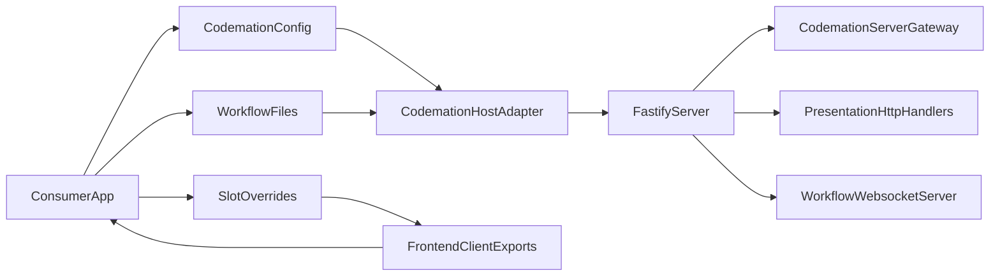

# Frontend Host Spike

**Status (repo today):** The production app shell is **`packages/next-host` (Next.js)** via `codemation dev`. There is no consumer `vite.config` and no `@codemation/frontend/vite` entry; sections below that mention Vite routes/plugins describe earlier spike options, not the current layout.

## Recommendation

The spike points to `React Router + Fastify` as the primary replacement for the current TanStack Start host layer, with `Vike + Fastify` as the comparison fallback.

The reason is straightforward:

- `@codemation/frontend` is already mostly host-agnostic.
- The consumer contract is already centered on `codemation.config.ts`, workflow files, optional boot hooks, and optional UI slots.
- The unstable part is the current Start adapter surface, not the frontend package itself.
- React Router route config is easier to compose from a package than a compiler-heavy fullstack framework.
- Fastify is a better owner for request lifecycle, websocket startup, and container scoping than a generated-route host.

## Current Host Surface

### Consumer-owned today

- `apps/test-dev/codemation.config.ts`
- `apps/test-dev/src/workflows/*`
- `apps/test-dev/src/bootstrap/testDevBootHook.ts`
- `apps/test-dev/src/ui/testDevLogo.tsx`
- `apps/test-dev/src/ui/testDevNavigation.tsx`

_(Legacy TanStack/Vite route files are not part of the current Next host.)_

### Framework-owned today

- `packages/frontend/src/presentation/config/CodemationConfig.ts`
- `packages/frontend/src/presentation/http/CodemationServerGateway.ts`
- `packages/frontend/src/presentation/http/*`
- `packages/frontend/src/presentation/websocket/WorkflowWebsocketServer.ts`
- `packages/frontend/src/ui/*`
- `packages/frontend/src/server.ts`

## What The Spike Proves

This spike implements the first host-neutral proof point inside the frontend package:

- `packages/frontend/src/ui/screens/WorkflowsScreen.tsx` no longer imports `@tanstack/react-router`.
- `packages/frontend/src/ui/workflowDetail/WorkflowRunsSidebar.tsx` no longer imports `@tanstack/react-router`.
- `packages/frontend/src/ui/screens/WorkflowDetailScreen.tsx` and `packages/frontend/src/ui/workflowDetail/useWorkflowDetailController.tsx` now support client-only mounting without SSR loader data.
- `packages/frontend/src/ui/screens/HostedWorkflowsScreen.tsx` and `packages/frontend/src/ui/screens/HostedWorkflowDetailScreen.tsx` expose no-SSR host wrappers for alternative hosts.

This means the frontend package is now less tied to TanStack Start even before any host migration begins.

## Primary Spike Shape

### React Router + Fastify

Use Fastify as the server/runtime owner and React Router as the route composition owner.



### Why this is the best fit

- Route ownership can be explicit code, not generated files.
- Package-provided route branches are easy to merge into a consumer route tree.
- Fastify can start websocket infrastructure at boot instead of hiding it behind framework routing.
- The server host can create or reuse a request/app-scoped Codemation container without parser tricks.

### Proposed host-owned pieces

- a tiny Fastify entrypoint
- a route composition module that mounts:
  - `/workflows`
  - `/workflows/:workflowId`
  - `/api/*`
- websocket startup during server boot
- one Vite plugin or watcher hook for workflow/config full reload

### Proposed framework package exports

- `Providers`
- `HostedWorkflowsScreen`
- `HostedWorkflowDetailScreen`
- `CodemationServerGateway`
- `ApiPaths`
- `CodemationConfig`

## Fallback Spike Shape

### Vike + Fastify

Vike remains a credible fallback if React Router route composition turns out to be awkward in practice.

Why it is second choice:

- Vike is much thinner than TanStack Start and works well with custom servers.
- `extends` and config inheritance fit package-owned framework composition better than most fullstack frameworks.
- But route ownership is still less naturally package-composed than React Router config arrays.

Use Vike only if:

- React Router framework mode adds too much host boilerplate, or
- Vike’s lower-level Vite integration materially improves HMR while keeping the host surface thin.

## Minimum Consumer Contract

The target contract should be:

- `codemation.config.ts`
- `src/workflows/*`
- optional `src/bootstrap/*`
- optional `src/ui/*` slot overrides
- no hand-written route modules
- no generated route files under consumer `src/routes`
- one tiny app entrypoint owned mostly by the host adapter

### Consumer example target

```text
apps/test-dev/
  codemation.config.ts
  src/
    workflows/
      example.ts
      demo.ts
    bootstrap/
      testDevBootHook.ts
    ui/
      testDevLogo.tsx
      testDevNavigation.tsx
    app/
      entry-client.tsx
      entry-server.ts
```

### HMR expectations

- workflow file edits should trigger a full reload or deterministic host refresh
- slot override edits should use normal React/Vite HMR
- package frontend component edits should use normal workspace source HMR
- websocket infrastructure should not require route regeneration to restart cleanly

## Migration Seams

### Files that can remain in place

- `packages/frontend/src/application/*`
- `packages/frontend/src/domain/*`
- `packages/frontend/src/presentation/http/*`
- `packages/frontend/src/presentation/websocket/WorkflowWebsocketServer.ts`
- `packages/frontend/src/ui/providers/Providers.tsx`
- most of `packages/frontend/src/ui/*`
- `apps/test-dev/codemation.config.ts`

### Files that were the first rewrite targets

- framework-owned host adapter glue _(historical; current host is Next in `packages/next-host`)_
- generated route files under consumer `src/routes` _(not used with Next host)_

### Files that need lifecycle review

- `packages/frontend/src/codemationApplication.ts`
- `packages/frontend/src/presentation/http/CodemationServerGateway.ts`

These files should survive, but the host migration should decide:

- whether `CodemationServerGateway` remains the server bridge or is replaced by direct Fastify boot wiring
- whether startup and teardown should become explicit public lifecycle operations
- whether handler registration should stay import side-effect based or move toward a clearer composition root

## Exact Phase 1 Change List

### Retain

- `packages/frontend/src/presentation/config/CodemationConfig.ts`
- `packages/frontend/src/presentation/http/CodemationServerGateway.ts`
- `packages/frontend/src/presentation/http/hono/CodemationHonoApiApp.ts`
- `packages/frontend/src/presentation/http/routeHandlers/*`
- `packages/frontend/src/presentation/websocket/WorkflowWebsocketServer.ts`
- `packages/frontend/src/ui/providers/Providers.tsx`
- `apps/test-dev/codemation.config.ts`

### Replace _(largely done: Next host)_

- earlier Vite / TanStack Start adapter glue _(removed from consumer; see `packages/next-host`)_

### Simplify before migration

- `packages/frontend/src/ui/screens/WorkflowsScreen.tsx`
- `packages/frontend/src/ui/workflowDetail/WorkflowRunsSidebar.tsx`
- `packages/frontend/src/ui/screens/WorkflowDetailScreen.tsx`
- `packages/frontend/src/ui/workflowDetail/useWorkflowDetailController.tsx`

## Conclusion

The current frontend package is already close to being host-neutral. The migration should not be framed as “replace the frontend framework”; it should be framed as “replace the host adapter around an already well-layered frontend package”.

The most promising path is:

1. keep `@codemation/frontend` as the product surface
2. replace the TanStack Start adapter with a thinner `React Router + Fastify` host
3. preserve the consumer contract around `codemation.config.ts`, workflows, slots, and boot hooks
4. keep SSR optional and avoid letting it shape the consumer model
