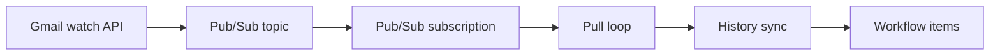

# @codemation/core-nodes-gmail

Gmail integration nodes for Codemation. New mail is ingested as workflow items using Gmail **push** (`users.watch` + Google Cloud Pub/Sub).

---

## What this package does

| Aspect       | Details                                                                                                         |
| ------------ | --------------------------------------------------------------------------------------------------------------- |
| **Goal**     | Trigger on new messages in a mailbox, optionally filtered by labels and a simple client-side query              |
| **Auth**     | Service account (domain-wide delegation) or OAuth2 (`gmail.readonly`)                                           |
| **Delivery** | Gmail `users.watch` publishes to a Pub/Sub topic; the runtime **polls the subscription** and processes messages |

Sending mail or changing labels is out of scope. This package is read-only and trigger-focused.

---

## Architecture

Gmail push assumes notifications land on a Pub/Sub topic. This implementation **pulls the subscription on an interval**, processes messages, and emits `OnNewGmailTrigger` output items.



- **Watch renewal**: When the watch is close to expiry, `ensureSetupState` refreshes the watch and keeps Pub/Sub consistent.
- **State**: `GmailTriggerSetupState` per trigger stores `historyId`, watch expiry, etc. (via the host `TriggerSetupStateStore`).

---

## Install and register the plugin

Add the workspace dependency and register **`GmailNodes`** in your Codemation `plugins` array.

```typescript
import { GmailNodes } from "@codemation/core-nodes-gmail";

// Default settings
plugins: [new GmailNodes()];

// Tune polling (milliseconds)
plugins: [
  new GmailNodes({
    pullIntervalMs: 5_000,
    maxMessagesPerPull: 10,
  }),
];
```

The `codemation.plugin` entry in `package.json` resolves the plugin to `GmailNodes`.

---

## Plugin options (`GmailNodes`)

| Field                | Type     | Default | Description                                                                     |
| -------------------- | -------- | ------- | ------------------------------------------------------------------------------- |
| `pullIntervalMs`     | `number` | `5000`  | Interval between Pub/Sub subscription pulls (ms). Clamped to a minimum of 25ms. |
| `maxMessagesPerPull` | `number` | `10`    | Max messages per pull. Minimum 1.                                               |

The runtime logs startup and pull counts under the `codemation-gmail.runtime` logger.

---

## Trigger node: `OnNewGmailTrigger`

### Role

- Bind Gmail credentials to slot **`auth`**.
- **Required field: `mailbox` only** (usually the mailbox user email; OAuth may use `me`).
- `topicName` / `subscriptionName` are optional; see [Pub/Sub name resolution](#pubsub-topic--subscription-resolution).

### Constructor

```typescript
new OnNewGmailTrigger(
  name: string,
  cfg: OnNewGmailTriggerOptions,
  id?: string,
  // Often supplied by the framework from the workflow definition
)
```

### Trigger options (`OnNewGmailTriggerOptions`)

| Field                 | Required | Example                                                                                                                  | Description                                                                                                                                     |
| --------------------- | -------- | ------------------------------------------------------------------------------------------------------------------------ | ----------------------------------------------------------------------------------------------------------------------------------------------- |
| `mailbox`             | Yes      | `"alice@company.com"`                                                                                                    | Mailbox to watch. With a service account, use the **delegated user** email. OAuth may use `"me"`.                                               |
| `topicName`           | No       | `"projects/my-gcp-project/topics/codemation-gmail"` (OAuth); `"codemation-gmail"` (short id with service account)        | Pub/Sub topic; falls back to resolver logic if omitted.                                                                                         |
| `subscriptionName`    | No       | `"projects/my-gcp-project/subscriptions/codemation-gmail"` (OAuth); `"codemation-gmail"` (short id with service account) | Pub/Sub subscription; falls back to resolver logic if omitted.                                                                                  |
| `labelIds`            | No       | `["INBOX", "My Label"]`                                                                                                  | Display names of labels. Resolved to label IDs via `GmailConfiguredLabelService`; the message must have **every** listed label.                 |
| `query`               | No       | `"purchase order"`                                                                                                       | Client-side filter: case-insensitive substring match against `From`, `To`, `Subject`, and `snippet` concatenated. Not full Gmail search syntax. |
| `downloadAttachments` | No       | `true`                                                                                                                   | When `true`, loads attachments into item binaries (`GmailTriggerAttachmentService`).                                                            |

Example `cfg` object (minimal vs. explicit Pub/Sub):

```typescript
// Minimal: mailbox only; topic/subscription resolved via credential project id or env (see Pub/Sub resolution)
{
  mailbox: "alice@company.com",
}

// Explicit Pub/Sub (typical for OAuth — fully qualified resource names)
{
  mailbox: "me",
  topicName: "projects/my-gcp-project/topics/gmail-push",
  subscriptionName: "projects/my-gcp-project/subscriptions/gmail-pull",
  labelIds: ["INBOX"],
  query: "urgent",
  downloadAttachments: true,
}
```

### Validation

- `resolveMissingConfigurationFields()` returns `mailbox` only when **`mailbox` is empty**.
- If Pub/Sub names cannot be resolved, the **runtime logs a warning and skips the trigger** (mailbox alone is not always enough).

### Output items (`OnNewGmailTriggerItemJson`)

Main fields on each item’s `json`:

| Field                                  | Description                                                                    |
| -------------------------------------- | ------------------------------------------------------------------------------ |
| `mailbox`                              | Target mailbox                                                                 |
| `historyId`                            | History id used for sync                                                       |
| `messageId`                            | Message id                                                                     |
| `threadId`                             | Thread id if present                                                           |
| `snippet`, `internalDate`              | Snippet and date                                                               |
| `labelIds`                             | Label id array                                                                 |
| `headers`                              | Header map (`Subject`, `From`, etc.)                                           |
| `from`, `to`, `subject`, `deliveredTo` | Common header shortcuts                                                        |
| `attachments`                          | Attachment metadata (linked to binaries when `downloadAttachments` is enabled) |

Manual **execute** fails if there are no pulled items (the trigger is event-driven).

---

## Credentials

### Slot

| Slot   | Label         | Accepted types                        |
| ------ | ------------- | ------------------------------------- |
| `auth` | Gmail account | `gmail.serviceAccount`, `gmail.oauth` |

### Type IDs

| Constant                              | Value                  |
| ------------------------------------- | ---------------------- |
| `GmailCredentialTypes.serviceAccount` | `gmail.serviceAccount` |
| `GmailCredentialTypes.oauth`          | `gmail.oauth`          |

---

### 1. Gmail service account (`gmail.serviceAccount`)

Uses Google Workspace **domain-wide delegation** to call the Gmail API as a user. The same service account credentials are used for Pub/Sub admin operations.

**Secret material:**

| Key             | Description                                               |
| --------------- | --------------------------------------------------------- |
| `clientEmail`   | Service account client email                              |
| `privateKey`    | PEM private key                                           |
| `projectId`     | GCP project id (also used as the default Pub/Sub project) |
| `delegatedUser` | User email to impersonate (often matches `mailbox`)       |

**Sources**: `db`, `env`, or `code` as registered.

**Pub/Sub name form**: With a service account you may pass **short resource ids** (e.g. `codemation-gmail`) for `topicName` / `subscriptionName`; the client combines them with `projectId` into full resource names.

---

### 2. Gmail OAuth (`gmail.oauth`)

OAuth2 with `https://www.googleapis.com/auth/gmail.readonly`, managed by the framework.

**Public fields:**

| Key        | Notes                                                                      |
| ---------- | -------------------------------------------------------------------------- |
| `clientId` | Optional when `CODEMATION_GOOGLE_CLIENT_ID` is set in the host environment |

**Secret fields:**

| Key            | Notes                                                  |
| -------------- | ------------------------------------------------------ |
| `clientSecret` | Optional when `CODEMATION_GOOGLE_CLIENT_SECRET` is set |

**Token material** follows host storage (keys such as `access_token`, `refresh_token`, `expiry` are read by the registry).

**Pub/Sub name form**: OAuth requires **fully qualified** names: `projects/{project}/topics/{id}` and `projects/{project}/subscriptions/{id}`. Short ids alone make `resolvePubSubResource` throw. `getDefaultGcpProjectIdForPubSub()` does **not** return a project for OAuth, so set **`GOOGLE_CLOUD_PROJECT`** (or `GCP_PROJECT` / `GCLOUD_PROJECT`) or explicit `topicName` / `subscriptionName` on the trigger.

---

## Pub/Sub topic / subscription resolution

`GmailTriggerPubSubResourceResolver` picks the **effective** Pub/Sub names from trigger config, environment, and credentials. The host’s `PluginContext.env` is injected; missing keys fall back to `process.env`.

### Resolution order (summary)

1. Non-empty **`topicName` / `subscriptionName`** on the trigger config
2. **`GMAIL_TRIGGER_TOPIC_NAME`** / **`GMAIL_TRIGGER_SUBSCRIPTION_NAME`**
3. If both names are still missing, **project id** from:
   - `getDefaultGcpProjectIdForPubSub()` (**service account `projectId` only**)
   - `GOOGLE_CLOUD_PROJECT` → `GCP_PROJECT` → `GCLOUD_PROJECT`
   - Or parsed from a partially specified FQ name
4. If project id is known and both names are empty, default segment **`codemation-gmail`**:
   - `projects/{projectId}/topics/codemation-gmail`
   - `projects/{projectId}/subscriptions/codemation-gmail`
5. If only one of topic/subscription is set, the other is inferred from FQ names or short default segments.

### GCP prerequisites

- A Pub/Sub **topic** exists and Gmail watch is allowed to publish to it.
- **`ensureSubscription`** creates the subscription on the topic if it does not exist (the runtime identity needs Pub/Sub permissions).
- Topic wiring for Gmail is usually done in Google Cloud per your organization’s process.

---

## Environment variables

| Variable                                                  | Purpose                                                                |
| --------------------------------------------------------- | ---------------------------------------------------------------------- |
| `GMAIL_TRIGGER_TOPIC_NAME`                                | Default Pub/Sub topic (FQ or short id with service account)            |
| `GMAIL_TRIGGER_SUBSCRIPTION_NAME`                         | Default subscription name                                              |
| `GOOGLE_CLOUD_PROJECT` / `GCP_PROJECT` / `GCLOUD_PROJECT` | Default project for OAuth Pub/Sub resolution, or helper for resolution |
| `CODEMATION_GOOGLE_CLIENT_ID`                             | OAuth client id override                                               |
| `CODEMATION_GOOGLE_CLIENT_SECRET`                         | OAuth client secret override                                           |

---

## Operational notes

1. **Polling**: Push is immediate to Pub/Sub, but this package only sees messages on each **pull interval**, so expect up to ~one interval of latency.
2. **Watch expiry**: `GmailWatchService` renews the watch when it is close to expiration.
3. **History gaps**: Stale `historyId` may raise `GmailHistoryGapError` and trigger baseline logic (see `GmailHistorySyncService`).
4. **Test items**: `getTestItems` fetches sample items via credentials on a separate path from production triggers.

---

## Logging

- **Trigger**: `codemation-gmail.trigger` (`GmailNodeTokens.TriggerLogger`)
- **Runtime**: `codemation-gmail.runtime` (`GmailNodeTokens.RuntimeLogger`)

If Pub/Sub cannot be resolved, the trigger **will not start** even with a valid `mailbox`—check runtime warnings first.

---

## Troubleshooting

| Symptom                                            | What to check                                                                      |
| -------------------------------------------------- | ---------------------------------------------------------------------------------- |
| Trigger never runs                                 | Non-empty `mailbox`; `auth` binding and credential test succeed                    |
| “Pub/Sub topic/subscription could not be resolved” | For OAuth: `GOOGLE_CLOUD_PROJECT` or FQ names; for SA: `projectId` and Pub/Sub IAM |
| Pub/Sub errors with OAuth                          | Avoid short topic names only; use **fully qualified** resource names               |
| No messages                                        | `labelIds` not too strict; `query` matches concatenated header/snippet text        |
| Too slow                                           | Lower `pullIntervalMs` (mind quota and load)                                       |

---

## Main exports

| Kind             | Name                                                                                                   |
| ---------------- | ------------------------------------------------------------------------------------------------------ |
| Plugin           | `GmailNodes`                                                                                           |
| Trigger config   | `OnNewGmailTrigger`, `OnNewGmailTriggerOptions`, `OnNewGmailTriggerItemJson`                           |
| Node impl        | `OnNewGmailTriggerNode`                                                                                |
| Credential types | `GmailCredentialTypes`                                                                                 |
| Types            | `GmailServiceAccountCredential`, `GmailOAuthCredential`, `GmailTriggerSetupState`, `GmailNodesOptions` |
| Runtime          | `GmailPullTriggerRuntime`                                                                              |
| Services         | `GmailWatchService`, `GmailHistorySyncService`, others                                                 |

---

## See also

- Repository conventions and testing: root `AGENTS.md`
- Engine and host boundaries: `packages/core` and host package docs
