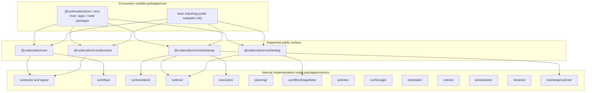

# `@codemation/core` public API boundary

This document defines the current **support boundary** for `@codemation/core`.
Its purpose is simple:

- make it obvious which imports are **public API**
- make it obvious which code is **internal and refactor-safe**
- give future refactors a concrete line they should not cross accidentally

## Audience

This is for framework contributors and package maintainers who need to decide:

- "Can I move or rename this safely?"
- "Does this belong on the main barrel?"
- "Is this a breaking change for consumers, or only an internal refactor?"

## Boundary diagram

## What is public

The following import paths are the supported package boundary:

- `@codemation/core`
- `@codemation/core/bootstrap`
- `@codemation/core/testing`
- `@codemation/core/browser`

Public API means:

- exported names on these entry points are part of the contract with downstream packages
- renaming, removing, or changing behavior here should be treated as a potential breaking change
- moving internal files is fine as long as these entry points remain stable

## What each public entry point is for

### `@codemation/core`

Use for:

- stable contracts and shared types
- workflow DSL and workflow-definition authoring
- DI primitives and stable tokens
- stable cross-package helpers that are intentionally consumer-facing

Do not expand this barrel with:

- engine composition roots
- runtime wiring helpers
- test-only fakes
- advanced internal runtime services

### `@codemation/core/bootstrap`

Use for:

- composition-root types needed by hosts
- engine runtime registration
- explicit advanced runtime services that hosts intentionally wire

This is public, but it is a **secondary public surface**, not the default consumer story.

### `@codemation/core/testing`

Use for:

- test-only helpers
- in-memory fakes that are useful for integration-style tests
- snapshot/testing utilities that should not be treated as production defaults

### `@codemation/core/browser`

Use for:

- browser-safe contract exports shared by UI packages

This should stay free of server/runtime-only concerns.

## What is internal

Everything under `packages/core/src/**` is internal **unless it is exported through one of the public entry points above**.

That means these folders are refactor-safe from a package-boundary perspective:

- `orchestration/`
- `runtime/`
- `execution/`
- `planning/`
- `workflowSnapshots/`
- `policies/`
- `runStorage/`
- `scheduler/`
- `events/`
- `serialization/`
- `binaries/`
- `bootstrap/runtime/`

Refactor-safe does **not** mean careless:

- internal imports across the monorepo still need to be updated together
- behavioral changes still need tests
- moving a type from internal code onto a public barrel changes its status immediately

## Safe refactors

The following are normally safe internal refactors if public subpath exports stay stable:

- move files between internal top-level systems
- rename internal classes that are not public exports
- consolidate thin wrappers into larger cohesive classes
- change host wiring internals behind `EngineRuntimeRegistrar`
- replace internal helper classes with private methods inside cohesive services

## Breaking-change triggers

Treat these as package-boundary changes:

- removing an export from `@codemation/core`, `@codemation/core/bootstrap`, `@codemation/core/testing`, or `@codemation/core/browser`
- changing the semantics of a public contract type or token
- changing import expectations for downstream packages without updating the supported subpath surface
- leaking new internal runtime pieces onto the main barrel by default

## Current tightening rules

Use these rules during future cleanup:

- prefer canonical repository names only; do not reintroduce catalog/store aliases
- keep the main barrel narrow and intention-revealing
- put composition and advanced runtime wiring on `@codemation/core/bootstrap`
- keep test-only helpers on `@codemation/core/testing`
- if a symbol is only needed by internal engine code, do not export it publicly

## Review checklist

Before merging a core refactor, ask:

- Does this change alter any export from a supported public subpath?
- If yes, is that intentional and documented as a breaking or additive API change?
- If no, can the change stay internal and avoid widening the public surface?
- Did we accidentally add an internal helper to the main barrel?
